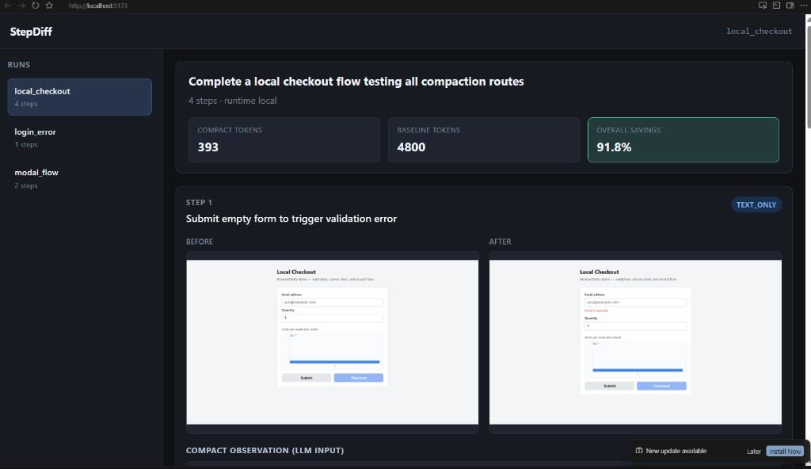
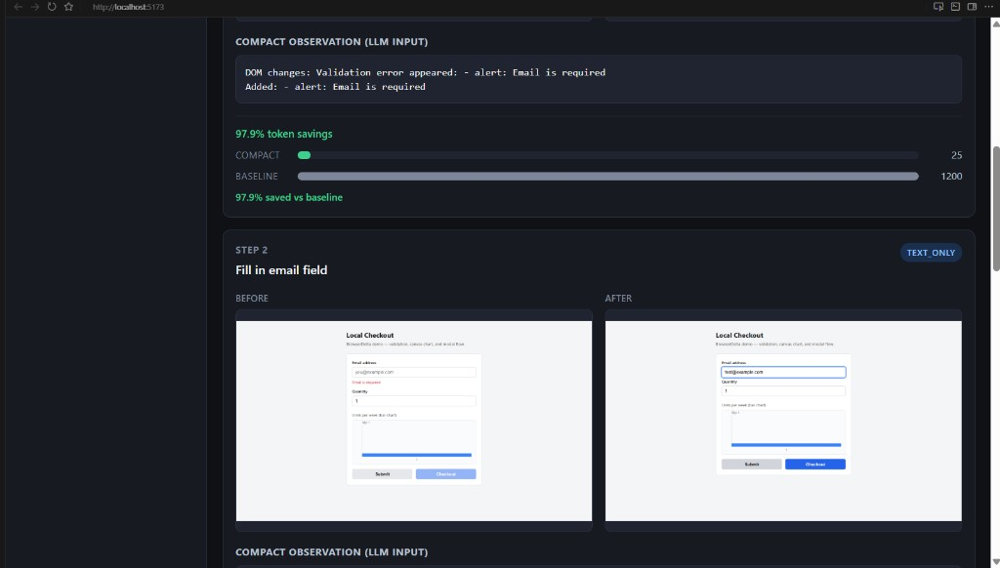
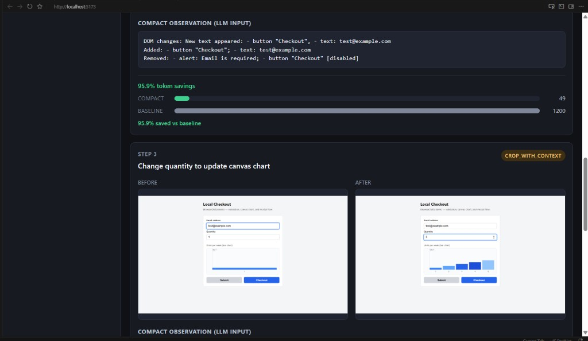
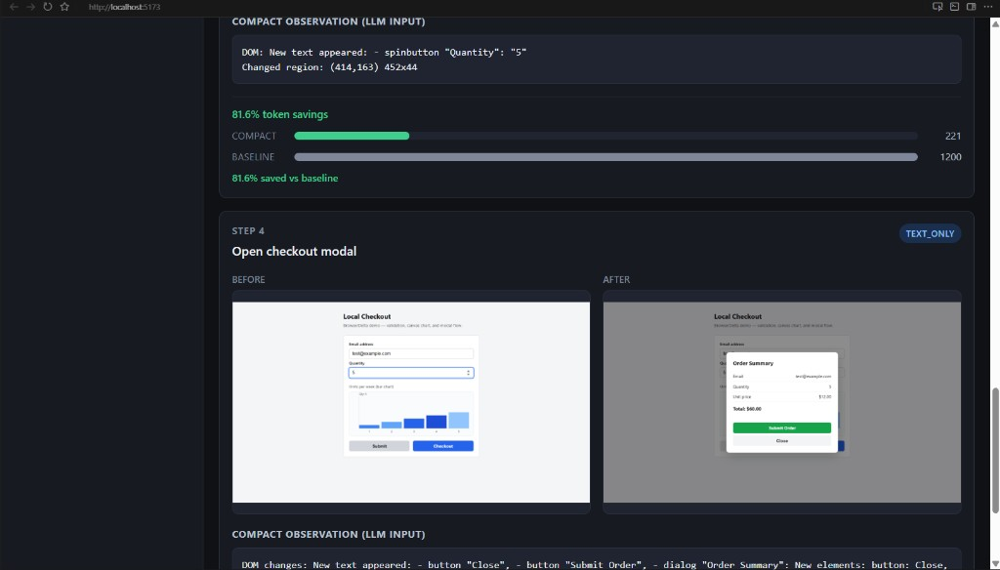
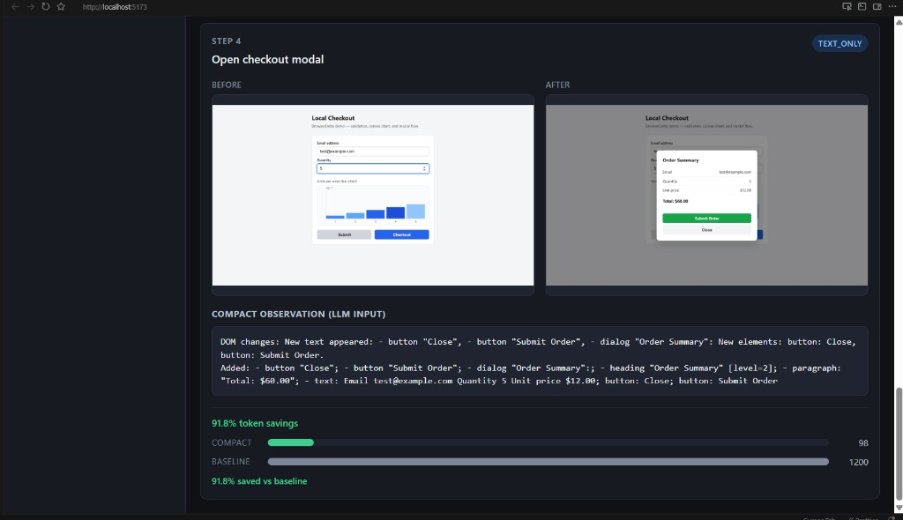

# StepDiff

Semantic compaction layer for browser automation agents. Instead of sending full screenshots to the LLM after every action, StepDiff diffs browser state and emits compact observations — typically 80-95% fewer tokens.

## Demo

The viewer replays recorded runs and shows before/after screenshots, the compact observation sent to the LLM, and token savings per step. Example: the `local_checkout` task compacts **4,800 baseline tokens → 393 compact tokens (91.8% savings)**.



**Step 1 — validation error (`text_only`)**  
Submit an empty form; StepDiff emits a short DOM diff instead of a full page snapshot.

**Step 2 — fill email (`text_only`, 97.9% savings)**  
Value-only field updates collapse to a few lines of text.



**Step 3 — quantity + chart (`crop_with_context`, 95.9% savings)**  
When the DOM change is small but the canvas updates visually, StepDiff crops the changed region with context.



**Step 4 — checkout modal (`text_only`, 91.8% savings)**  
Structural changes (new dialog, buttons) route to a text-only DOM summary.





Run the viewer locally after recording a run:

```bash
cd viewer && npm install && npm run dev
```

API must be running on port 8000 (`uvicorn stepdiff.main:app --reload --app-dir backend`).

## Quick start

**macOS / Linux**
```bash
cd stepdiff   # project directory (rename from browserdelta if needed)
python3 -m venv .venv && source .venv/bin/activate
pip install -e ".[dev]"
python -m playwright install chromium
cp .env.example .env  # add your ANTHROPIC_API_KEY
```

**Windows (cmd)**
```bat
cd stepdiff   REM project directory (rename from browserdelta if needed)
python -m venv .venv
.venv\Scripts\activate.bat
pip install -e ".[dev]"
python -m playwright install chromium
copy .env.example .env
```

**Windows (PowerShell)**
```powershell
cd stepdiff   # project directory (rename from browserdelta if needed)
python -m venv .venv
.venv\Scripts\Activate.ps1
pip install -e ".[dev]"
python -m playwright install chromium
Copy-Item .env.example .env
```

Run the local proof (no internet, no paid services except Claude):
```bash
python scripts/record_demo.py --task tasks/local_checkout.json --run-id local_checkout --headless --compact --runtime local
```

Evaluate with Claude:
```bash
python scripts/eval_run.py runs/local_checkout --predictor llm --compare
```

Replay eval needs **at least 2 steps** (it predicts step N+1 from step N). Single-step runs like `login_error` compact fine but skip eval — use `modal_flow` or `local_checkout` instead.

Start the API:
```bash
uvicorn stepdiff.main:app --reload --app-dir backend
```

Run tests:
```bash
pytest
```

Run example fixture contracts only (no browser):
```bash
pytest tests/test_example_runs.py -v
```

Run the large synthetic test matrix (~25 routing + ~12 DOM cases, no browser):
```bash
python scripts/run_test_matrix.py
pytest tests/test_routing_matrix.py tests/test_dom_diff_matrix.py -v
```

Run full suite:
```bash
python scripts/run_test_matrix.py --full
```

Record all Playwright tasks:
```bash
python scripts/record_demo.py --task tasks/login_error.json --run-id login_error --headless --compact
python scripts/record_demo.py --task tasks/modal_flow.json --run-id modal_flow --headless --compact
python scripts/record_demo.py --task tasks/local_checkout.json --run-id local_checkout --headless --compact
```

## Stack
- Browser: Playwright (local Chromium)
- Backend: FastAPI + Python
- Diffs: Pillow + NumPy (visual), stdlib (DOM)
- LLM: Claude (Anthropic) — for replay eval only
- Viewer: Vite + React

Optional: [Tesseract OCR](https://github.com/tesseract-ocr/tesseract) improves `crop_with_context` text extraction; compaction works without it.
